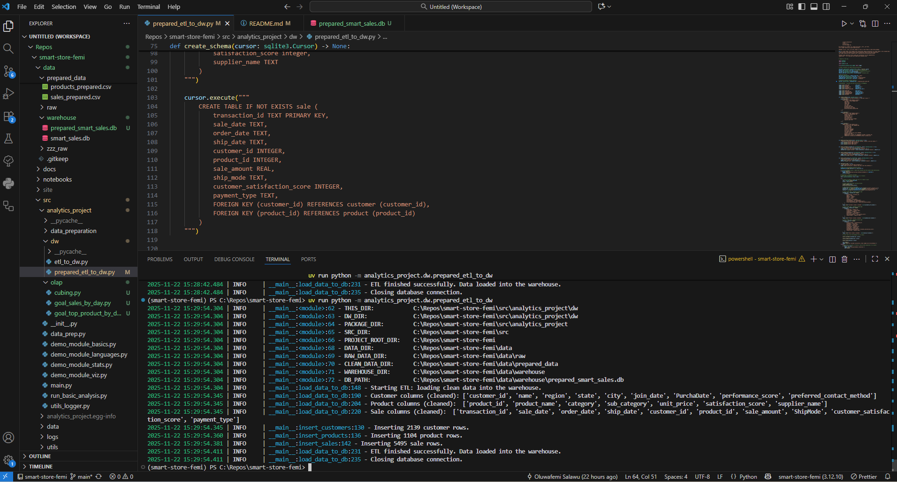
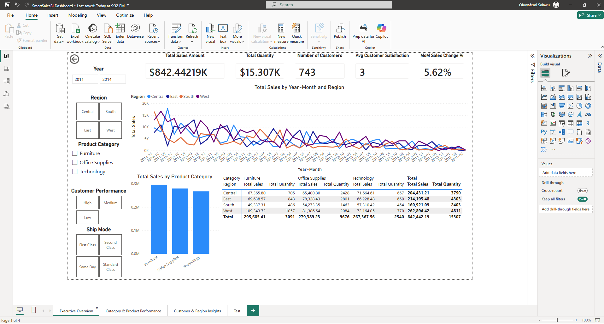
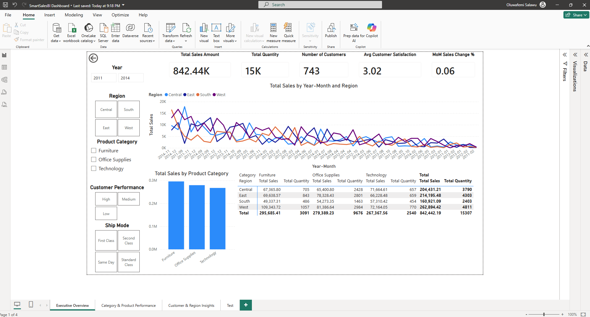
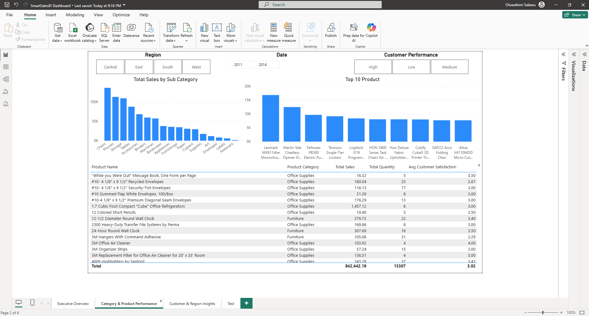
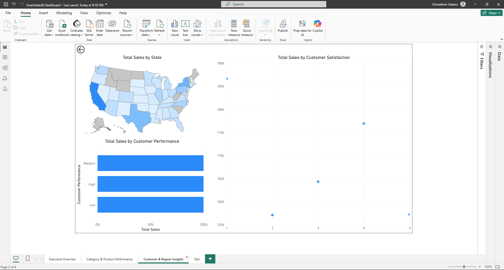

# Smart Sales BI – OLAP & Dashboard Project
## Business Intelligence Analytics Project - smart-store-femi Documentation

### 👩🏽‍💻 Author

**Oluwafemi Salawu**
*Data & Business Intelligence Analyst*
📧 [ogsalawu@gmail.com]
🔗 [https://github.com/Airfirm]


# Smart Sales BI – OLAP & Dashboard Project

## Overview

The **Smart Sales BI Project** is a business intelligence solution designed to analyze
sales performance across products, regions, and customer segments. The solution
uses a star-schema data warehouse and Power BI to support interactive OLAP-style
analysis (slicing, dicing, and drill-down).

The goal is to help decision-makers identify which product categories, regions,
and customer groups drive revenue growth – and where improvement opportunities exist.

---

## Business Goal

**Primary Goal:**  
Identify the top-performing product categories and regions by monthly sales and
understand how customer performance, shipping mode, and satisfaction contribute
to revenue trends.

This supports better decisions in inventory planning, regional marketing,
and customer relationship management.

---

## Data Model

The model follows a **star schema**:

- **Fact Table**
  - `sale`
    - TransactionID (primary key), CustomerID, ProductID
    - SaleDate, OrderDate, ShipDate
    - SaleAmount
    - ShipMode, CustomerSatisfactionScore, PaymentType

- **Dimension Tables**
  - `customer`
    - CustomerID (primary key), Name, Region, State, City
    - JoinDate, PurchaDate, PerformanceScore
    - PreferredContactMethod
  - `product`
    - ProductID (primary key), ProductName, Category, SubCategory
    - UnitPrice, SatisfactionScore, SupplierName
  - `Date`
    - Date (key), Year, Quarter, Month, Year-Month, DayOfWeek

Relationships:
- `Date[Date]` → `sale[SaleDate]`
- `customer[CustomerID]` → `sale[CustomerID]`
- `product[ProductID]` → `sale[ProductID]`

---

## Key Measures (DAX)

Examples of core measures:

- `Total Sales = SUM(sale[SaleAmount])`
- `Total Quantity = SUM(sale[Quantity])`
- `Total Transactions = COUNTROWS(sale)`
- `Distinct Customers = DISTINCTCOUNT(sale[CustomerID])`
- `Avg Sales per Transaction = DIVIDE([Total Sales], [Total Transactions])`
- `Avg Selling Price = DIVIDE([Total Sales], [Total Quantity])`
- `Avg Customer Satisfaction = AVERAGE(sale[CustomerSatisfactionScore])`

Time intelligence:

- `Total Sales YTD`
- `MoM Sales Change`, `MoM Sales Change %`
- `YoY Sales Change`, `YoY Sales Change %`
- `Running Total Sales`

Ranking:

- `Category Rank by Sales`
- `Region Rank by Sales`

---

## Dashboards & Visuals

The Power BI report includes:

1. **Overview Dashboard**
   - KPI cards: Total Sales, Total Quantity, Distinct Customers, Avg Satisfaction
   - Line chart: Total Sales by Month (with Year/Region filters)
   - Bar chart: Sales by Product Category
   - Map or filled map: Sales by Region/State
   - Slicers: Year, Region, Category, Ship Mode

2. **Category & Product Performance**
   - Bar / column charts: Sales by Category and SubCategory
   - Table / matrix: Category × Region with Total Sales
   - Drill-down: Category → SubCategory → Product

3. **Customer & Region Insights**
   - Stacked bar: Sales by Customer Performance Level
   - Matrix: Region × Performance × Total Sales
   - Scatter: Customer Satisfaction vs SalesAmount

---

## How to Use

1. Open `SmartSalesBI.pbix` in **Power BI Desktop**.
2. Refresh data from the data warehouse / prepared CSV files.
3. Explore the Overview page to see high-level sales trends.
4. Use slicers (Year, Region, Category, Performance) to slice and dice.
5. Drill down on visuals to move from summary to detailed views.

---

## Future Improvements

- Add margin and profit metrics.
- Incorporate forecasting models for demand planning.
- Integrate cloud-based data sources (e.g., Azure Synapse, BigQuery).

## Images:






---

## 🧠 Smart Store Analytics Project

### Data Preparation: Applied the following process for each project data files 


Absolutely — here’s a **clear, structured explanation** of each visual you created in Power BI and what story they tell about your data.

---

# ✅ **1. Left Visual: Customer Spend Breakdown (Hierarchy Table)**

**What it shows:**

* A list of customers and the **total amount they spent**.
* You also drilled down into **Year (2025)** and **Quarter (Q2)** for each customer.

**How to read it:**

* Each customer has a **total spending amount**.
* Clicking the ➤ expands their data into:

  * **Year** → shows all spending in that year
  * **Quarter** → shows spending in a specific quarter

**What insight it provides:**

* Identifies **top-spending customers**
* Lets you see **seasonal patterns** (Q2 spending here)
* Great for customer segmentation and LTV (lifetime value)

---

# ✅ **2. Middle Visual: Payment Method by Category (Matrix / Dice Analysis)**

**What it shows:**

* A **matrix** summarizing total spending by **Product Category** and **Payment Method**.

Columns:

* Bank Transfer
* Cash
* Credit Card
* Debit Card
* PayPal
* Total

Rows:

* Clothing
* Electronics
* Home
* Office
* Total

**How to read it:**
Example:

* Clothing = 532 total spent, split across all payment types
* Electronics = 385 total
* Office = 455 total

**What insight it provides:**
✔ Shows which **product categories** customers spend more on
✔ Reveals how payment types vary by category

* e.g., maybe Office uses more "Debit Card"
  ✔ This is a perfect example of **dicing** by:
* Category (Dimension 1)
* Payment Type (Dimension 2)

This is *exactly* how BI slicing/dicing should look.

---

# ✅ **3. Right Visual: Total Spending by Quarter (Bar Chart)**

**What it shows:**

* A **bar chart** showing the Sum of Total Spent grouped by **Quarter** (Q2 shown).
* X-axis: Year → Quarter → Month Name
* Y-axis: Sum of total_spent (e.g., 2M+)

**Why only Q2 appears:**
Your dataset likely only contains transactions for Q2 of 2025, so that’s the only bar.

**What insight it provides:**

* Total sales during that quarter
* If more data existed, you’d compare Q1 vs Q2 vs Q3 vs Q4
* Good for identifying seasonal trends

---

# 🔍 **Overall Dashboard Story (What You’ve Built)**

Together, these visuals show:

### **Customer-Level Insights (Left)**

➡ Top spenders, with drill-down by quarter
➡ Helps with customer segmentation and targeting

### **Product Category + Payment Behavior (Middle)**

➡ Which categories are most profitable
➡ How customers prefer to pay
➡ True “dice” analytic: two categorical dimensions

### **Quarterly Sales Trend (Right)**

➡ How much was spent in Q2
➡ Seasonal trend (if more quarters existed)

---

# 🎯 **What You Did Well**

* Used **hierarchies** (Year → Quarter)
* Performed **dicing** (Category × Payment Method)
* Used a **trend visual** (Quarterly sales bar chart)
* Relationships seem properly set up — visuals align correctly
* This dashboard already looks like something for a business stakeholder

---


# Screenshots:

  

---
def save_prepared_data(df: pd.DataFrame, file_name: str) -> None:
    """Save cleaned data to CSV."""
    file_path = PREPARED_DATA_DIR / file_name
    df.to_csv(file_path, index=False)
    logger.info(f"✅ Data saved to {file_path}")


def remove_duplicates(df: pd.DataFrame) -> pd.DataFrame:
    logger.info(f"Removing duplicates from DataFrame with shape {df.shape}")
    if df.empty:
        logger.warning("DataFrame is empty — skipping duplicate removal.")
        return df
    return DataScrubber(df).remove_duplicate_records()


def handle_missing_values(df: pd.DataFrame) -> pd.DataFrame:
    logger.info(f"Handling missing values for DataFrame shape {df.shape}")
    if df.empty:
        logger.warning("DataFrame is empty — skipping missing value handling.")
        return df

    missing_before = df.isna().sum().sum()
    logger.info(f"Missing values before: {missing_before}")

    if "PreferredContactMethod" in df.columns:
        df.dropna(subset=["PreferredContactMethod"], inplace=True)

    missing_after = df.isna().sum().sum()
    logger.info(f"Missing values after: {missing_after}")
    return df


def remove_outliers(df: pd.DataFrame) -> pd.DataFrame:
    logger.info("Removing outliers...")
    if df.empty:
        logger.warning("DataFrame is empty — skipping outlier removal.")
        return df

    initial_count = len(df)
    if "PerformanceScore" in df.columns:
        df = df[(df["PerformanceScore"] >= 60) & (df["PerformanceScore"] <= 100)]
    logger.info(f"Removed {initial_count - len(df)} outliers.")
    return df
---

### 📋 Project Overview

The **Smart Store Analytics** project is designed to demonstrate how Business Intelligence (BI) and Data Analytics tools can be used to extract insights from retail data.
Using **Python**, **pandas**, and **Power BI**, this project explores patterns in sales, customer behavior, and product pricing to support **data-driven decision-making**.

The goal is to automate data analysis and produce reports that can help business leaders identify trends, optimize pricing, and forecast performance — combining ETL concepts, BI visualization, and statistical techniques.

---

### 🏗️ Project Structure

```
smart-store-femi/
│
├── data/
│   └── raw/
│       ├── customers_data.csv
│       ├── products_data.csv
│       ├── sales_data.csv
│       └── analysis_results/
│           └── analysis_results.csv
│
├── src/
│   └── analytics_project/
│       ├── __init__.py
│       └── run_basic_analysis.py
│
├── .pre-commit-config.yaml
├── pyproject.toml
├── README.md
└── requirements.txt
```

---

### ⚙️ Features

* **Automated Data Cleaning:**
  Cleans messy or non-numeric data (e.g., “$1,234.50”) for reliable analysis.
* **Descriptive Analytics:**

  * Finds most common customer locations.
  * Identifies highest and lowest product prices.
  * Calculates average, minimum, and maximum sales.
* **Data Quality Checks:**
  Detects missing, duplicate, and non-numeric values.
* **Automated Output:**
  Saves all key insights in `data/raw/analysis_results/analysis_results.csv`.
* **Pre-commit Integration:**
  Uses **Ruff** and **pre-commit hooks** for linting, formatting, and style consistency.

---

### 🧮 Example Insights

| Metric                        | Example Output                       |
| ----------------------------- | ------------------------------------ |
| Most Common Customer Location | Dallas, TX                           |
| Highest Product Price         | $1,299.99                            |
| Lowest Product Price          | $3.49                                |
| Average Sales Amount          | $782.56                              |
| Data Issues Found             | 5 missing values in `sales_data.csv` |

---

### 🚀 How to Run the Project

1. **Clone the repository:**

   ```bash
   git clone https://github.com/<your-username>/smart-store-femi.git
   cd smart-store-femi
   ```

2. **Activate your virtual environment:**

   ```bash
   uv venv .venv
   .venv\Scripts\activate
   ```

3. **Install dependencies:**

   ```bash
   uv pip install -r requirements.txt
   ```

4. **Run the analysis:**

   ```bash
   uv run python -m src.analytics_project.run_basic_analysis
   ```

5. **View output:**

   * Results are saved in:

     ```
     data/raw/analysis_results/analysis_results.csv
     ```

---

### 🧰 Tools & Technologies

* **Python 3.11+**
* **pandas** for data analysis
* **Ruff** for linting and formatting
* **Pre-commit** hooks for code quality enforcement
* **GitHub** for version control
* **Power BI / Tableau** (optional for visual exploration)
* **VS Code** as primary development environment

---

### 📊 Business Intelligence Relevance

This project aligns with **BI principles** by:

* Applying **data-driven decision-making (DDDM)**.
* Using **cross-platform tools** like Python and Git for collaboration.
* Automating **ETL-like data preparation and exploration**.
* Supporting **scalable analytics workflows** (Apache Spark integration possible).

---

### ✅ Next Steps

* Add visualization layer (Power BI or Python’s `plotly`/`matplotlib`).
* Integrate SQL or Snowflake for larger datasets.
* Extend model for forecasting sales trends (using regression or time series).

---


> Use this repo to start a professional Python project.

- Additional information: <https://github.com/Airfirm/smart-store-femi>
- Project organization: [STRUCTURE](./STRUCTURE.md)
- Build professional skills:
  - **Environment Management**: Every project in isolation
  - **Code Quality**: Automated checks for fewer bugs
  - **Documentation**: Use modern project documentation tools
  - **Testing**: Prove your code works
  - **Version Control**: Collaborate professionally

---

## WORKFLOW 1. Set Up Your Machine

Proper setup is critical.
Complete each step in the following guide and verify carefully.

- [SET UP MACHINE](./SET_UP_MACHINE.md)

---

## WORKFLOW 2. Set Up Your Project

After verifying your machine is set up, set up a new Python project by copying this template.
Complete each step in the following guide.

- [SET UP PROJECT](./SET_UP_PROJECT.md)

It includes the critical commands to set up your local environment (and activate it):

```shell
uv venv
uv python pin 3.12
uv sync --extra dev --extra docs --upgrade
uv run pre-commit install
uv run python --version
```

**Windows (PowerShell):**

```shell
.\.venv\Scripts\activate
```

**macOS / Linux / WSL:**

```shell
source .venv/bin/activate
```

---

## WORKFLOW 3. Daily Workflow

Please ensure that the prior steps have been verified before continuing.
When working on a project, we open just that project in VS Code.

### 3.1 Git Pull from GitHub

Always start with `git pull` to check for any changes made to the GitHub repo.

```shell
git pull
```

### 3.2 Run Checks as You Work

This mirrors real work where we typically:

1. Update dependencies (for security and compatibility).
2. Clean unused cached packages to free space.
3. Use `git add .` to stage all changes.
4. Run ruff and fix minor issues.
5. Update pre-commit periodically.
6. Run pre-commit quality checks on all code files (**twice if needed**, the first pass may fix things).
7. Run tests.

In VS Code, open your repository, then open a terminal (Terminal / New Terminal) and run the following commands one at a time to check the code.

```shell
uv sync --extra dev --extra docs --upgrade
uv cache clean
git add .
uvx ruff check --fix
uvx pre-commit autoupdate
uv run pre-commit run --all-files
git add .
uv run pytest
```

NOTE: The second `git add .` ensures any automatic fixes made by Ruff or pre-commit are included before testing or committing.

<details>
<summary>Click to see a note on best practices</summary>

`uvx` runs the latest version of a tool in an isolated cache, outside the virtual environment.
This keeps the project light and simple, but behavior can change when the tool updates.
For fully reproducible results, or when you need to use the local `.venv`, use `uv run` instead.

</details>

### 3.3 Build Project Documentation

Make sure you have current doc dependencies, then build your docs, fix any errors, and serve them locally to test.

```shell
uv run mkdocs build --strict
uv run mkdocs serve
```

- After running the serve command, the local URL of the docs will be provided. To open the site, press **CTRL and click** the provided link (at the same time) to view the documentation. On a Mac, use **CMD and click**.
- Press **CTRL c** (at the same time) to stop the hosting process.

### 3.4 Execute

This project includes demo code.
Run the demo Python modules to confirm everything is working.

In VS Code terminal, run:

```shell
uv run python -m analytics_project.demo_module_basics
uv run python -m analytics_project.demo_module_languages
uv run python -m analytics_project.demo_module_stats
uv run python -m analytics_project.demo_module_viz
```

You should see:

- Log messages in the terminal
- Greetings in several languages
- Simple statistics
- A chart window open (close the chart window to continue).

If this works, your project is ready! If not, check:

- Are you in the right folder? (All terminal commands are to be run from the root project folder.)
- Did you run the full `uv sync --extra dev --extra docs --upgrade` command?
- Are there any error messages? (ask for help with the exact error)

---

### 3.5 Git add-commit-push to GitHub

Anytime we make working changes to code is a good time to git add-commit-push to GitHub.

1. Stage your changes with git add.
2. Commit your changes with a useful message in quotes.
3. Push your work to GitHub.

```shell
git add .
git commit -m "describe your change in quotes"
git push -u origin main
```

This will trigger the GitHub Actions workflow and publish your documentation via GitHub Pages.

### 3.6 Modify and Debug

With a working version safe in GitHub, start making changes to the code.

Before starting a new session, remember to do a `git pull` and keep your tools updated.

Each time forward progress is made, remember to git add-commit-push.


